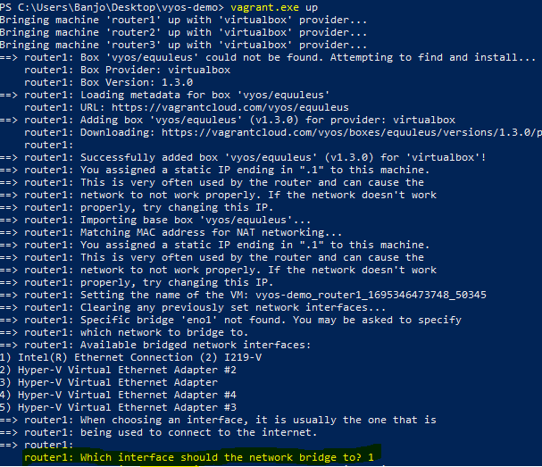

# Vyos Ansible Demo

Explore a simple network automation approach for constructing a BGP network in  using Ansible and Vagrant within a VirtualBox environment. This setup has been successfully tested on Fedora Core 37 and Windows 10 using WSL. When executing ```$ vagrant up``` from Windows, it will likely prompt you to specify the bridge interface, as demonstrated below.





The public_network functions as a bridge to your existing home network, enabling direct SSH access to reconfigure the management IP of the VYOS accordingly. The default management IP utilizes the 192.168.123.0/24 subnet. Meanwhile, the private_network employs the 192.168.5.0/30 and 192.168.56.4/30 subnets for point-to-point connectivity, respectively.

I have disabled SSH host key verification in ansible.cfg, so exercise caution while working with this setup.


### Requirement:

1. Ansible (for Windows follow the instructions from this )
2. Vagrant
3. Virtualbox
4. Git

| Host    | Interface  | IP Address      |
| ------- | -----------| --------------- |
| router1 | management | 192.168.123.103 |
| router2 | management | 192.168.123.104 |
| router3 | management | 192.168.123.105 |


### Changing management IP
If you're planning to change the management IP, you must change the *Vagrantfile* and the *inventory* file respectively.  

For e.g., changing from 192.168.103.X network to 192.168.1.X


### Before:

**Vagrantfile:**
```
    router1.vm.network "public_network", bridge: "eno1", ip: "192.168.103.103"
```

**inventory:**
```
        router1.mylab.com:
          ansible_host: 192.168.123.103
```


### After
**Vagrantfile:**
```
    router1.vm.network "public_network", bridge: "eno1", ip: "192.168.1.103"
```

**inventory:**
```
        router1.mylab.com:
          ansible_host: 192.168.123.103
```


### Network Diagram:


### Instructions:

1. Clone this repo using git.
2. run ``` $ vagrant plugin install vagrant-vyos```
3. run ``` $ vagrant up ```
4. run ``` $ ansible-playbook -i inventory bgp.yaml ```
5. ssh to one of the VYOS and run ``` sh ip ro ``` to check the routes. You will find the BGP routes marked as **B>***
   


