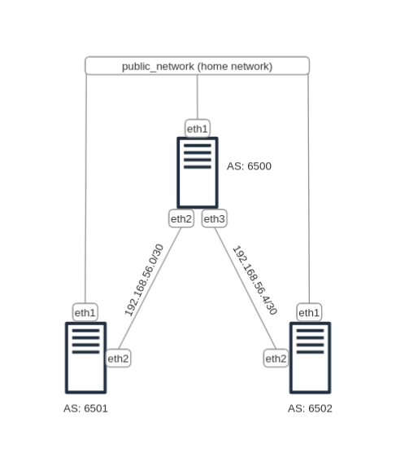
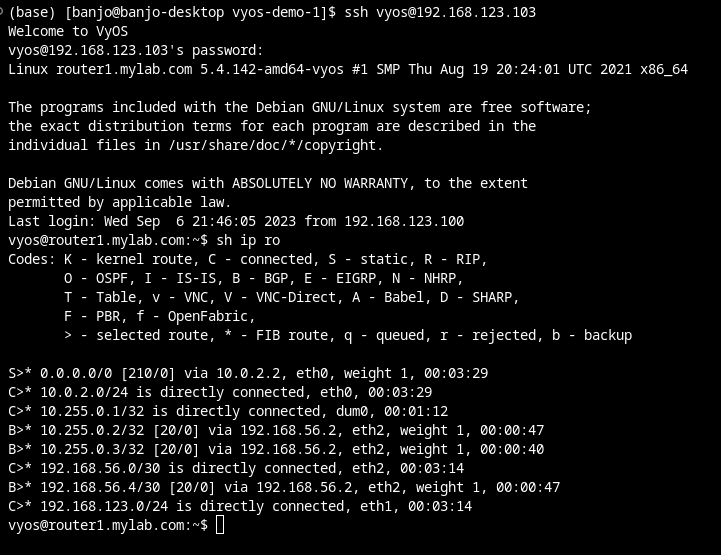

# Vyos Ansible Demo

Very simple Network Automation for building a BGP network in VYOS using Ansible and Vagrant in VirtualBox environment. This has been tested in a Fedora Core 37 Operating system and Windows 10 using WSL. 
The public_network is a bridge to your existing home network so you can access the SSH directly so reconfigure the management IP of the VYOS accordingly. The default management IP is using 192.168.123.0/24 subnet. While the private_network is using 192.168.5.0/30 and 192.168.56.4/30 for point-to-point connectivity respectively. 

I've turned off ssh host key verification in ansible.cfg. So, work with caution.


Requirement:

1. Ansible (for Windows follow the instructions from this 
2. Vagrant
3. Virtualbox
4. Vagrant 
5. Vagrant vyos plugin 
6. Git

| Host    | Interface  | IP Address      |
| ------- | -----------| --------------- |
| router1 | management | 192.168.123.103 |
| router2 | management | 192.168.123.104 |
| router3 | management | 192.168.123.105 |


Network Diagram:




### Instructions:

1. Clone this repo using git.
2. run ``` $ vagrant plugin install vagrant-vyos```
3. run ``` $ vagrant up ```
4. run ``` $ ansible-playbook -i inventory bgp.yaml ```
5. ssh to one of the VYOS and run ``` sh ip ro ``` to check the routes. You will find the BGP routes marked as **B>***
   


